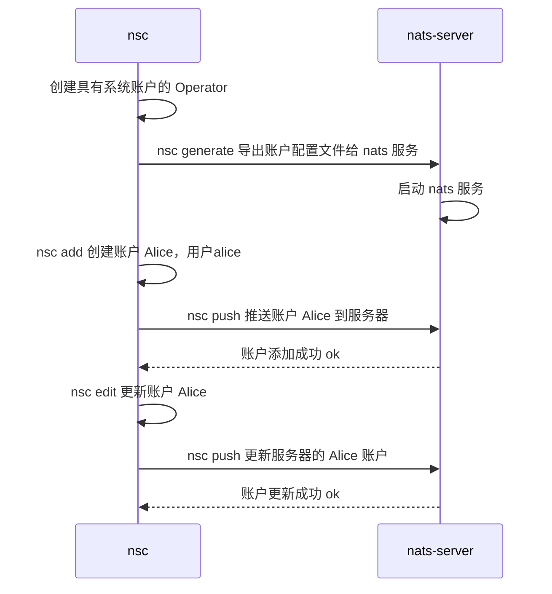

# NATS Account

- [NATS Account](#nats-account)
  - [用户验证](#用户验证)
    - [授权配置](#授权配置)
      - [Token](#token)
    - [用户配置](#用户配置)
  - [用户权限](#用户权限)
  - [多租户](#多租户)
    - [配置](#配置)
    - [test](#test)
  - [nsc](#nsc)
    - [账户 JWT 深度解析](#账户-jwt-深度解析)
    - [账户解析器](#账户解析器)
      - [基于 NATS 的解析器](#基于-nats-的解析器)
      - [MEMORY](#memory)
      - [URL 解析器](#url-解析器)
    - [CMD](#cmd)
      - [初始化账户(init)](#初始化账户init)
      - [查看账户信息(describe)](#查看账户信息describe)
      - [导出配置文件(config)](#导出配置文件config)
      - [添加账户(add)](#添加账户add)
      - [修改环境变量(env)](#修改环境变量env)
      - [推送账户(push)](#推送账户push)
      - [内置工具(tool)](#内置工具tool)
      - [导入流/服务(import)](#导入流服务import)
        - [import 私有流/服务](#import-私有流服务)
    - [账户签名](#账户签名)
      - [范围签名](#范围签名)

## 用户验证

NATS 服务器提供了多种客户端的方式：

- Token 认证
- 用户名密码
- TSL 证书
- NKeys 密钥验证
- 去中心化的 JWT 认证/授权

身份验证处理允许 NATS 客户端连接到服务器。除了 JWT 认证，认证和授权都在配置的授权部分进行配置。

### 授权配置

授权块提供身份验证配置以及授权

| 属性     | 描述                                     |
| -------- | ---------------------------------------- |
| token    | 指定可用于向服务器进行身份验证的全局令牌 |
| user     | 为服务器的客户端指定单个全局用户名       |
| password | 为服务器的客户端指定一个全局密码         |
| users    | 多用户配置映射列表                       |
| timeout  | 等待客户端身份验证的最大秒数             |

用户配置

| 属性        | 描述                                                   |
| ----------- | ------------------------------------------------------ |
| user        | 用于客户端身份验证的用户名。 （也可以是tls认证的用户） |
| password    | 用户输入密码                                           |
| nkey        | 标识用户的公钥                                         |
| permissions | 配置用户可访问主题的权限映射                           |

#### Token

令牌身份验证是一个字符串，如果由客户端提供，则允许其连接。它是 NATS 服务器提供的最直接的身份验证。

### 用户配置

## 用户权限

NATS 服务器支持在每个用户的基础上使用**主题**级别权限进行授权。基于权限的授权可通过用户列表进行多用户身份验证。

每个权限指定用户可以发布和订阅的主题。解析器在理解意图是什么方面很慷慨，因此数组和单例都被处理了。对于更复杂的配置，您可以指定明确允许或拒绝主体的权限对象。指定的主题也可以指定通配符。权限可以使用变量。

| 属性              | 描述                                                                                                                                                                   |
| ----------------- | ---------------------------------------------------------------------------------------------------------------------------------------------------------------------- |
| `publish`         | 客户可以发布的主题、主题列表或权限映射                                                                                                                                 |
| `subscribe`       | 客户可以订阅的主题、主题列表或权限映射。在这种情况下，可以提供一个可选的队列名称：`<subject> <queue>` 来表示队列组权限。这些权限还可以使用通配符，例如 `v2.*` 或 `>`。 |
| `allow_responses` | 布尔值或响应映射，默认为 `false`， 设置为 `true` 时，最大响应是 1，没有时间限制                                                                                        |

```conf
authorization {
  default_permissions = {   # 默认权限，如果用户没有额外设置权限，则使用此权限
    publish = "SANDBOX.*"
    subscribe = ["PUBLIC.>", "_INBOX.>"]
  }
  ADMIN = {
    publish = ">"
    subscribe = ">"
    allow_responses = true # 最大响应数是 1，没有时间限制
  }
  REQUESTOR = {
    publish = ["req.a", "req.b"]
    subscribe = "_INBOX.>"
  }
  RESPONDER = {
    subscribe = ["req.a", "req.b"]
    publish = "_INBOX.>"
    allow_responses = { max: 5, expires: "1m" } # 配置最大响应数以及该权限的有效期
  }
  DenyAllow = {
    publish= {
      allow= "*.*"            # 允许 任意 *.* 格式的的主题
      deny= ["test.*", "a.b"] # 禁止对 test.* 和 `a.b` 主题发布消息
    }
    subscribe= {      
      deny= "b.>"             # 禁止接收 b.> 主题的消息
    }
  }

  users = [
    {user: admin,   password: admin, permissions: $ADMIN}
    {user: client,  password: client, permissions: $REQUESTOR}
    {user: service,  password: service, permissions: $RESPONDER}
    {user: other, password: other}
    {user: test, password: test, permissions: $DenyAllow}
  ]
}
```

其中 `allow_responses` 属性设置测试没有生效，使用 nsc 的`--allow-pub-response` 和 `--response-ttl` 参数设置账户权限后，发布失败，不明所以

## 多租户

帐户在授权基础上扩展。使用传统授权，所有客户端都可以发布和订阅任何内容，除非另有明确配置。为了保护客户和信息，您必须仔细雕刻主题空间和许可客户。

帐户允许对客户端进行分组，将它们与其他帐户中的客户端隔离开来，从而在服务器中启用多租户。使用帐户，主题空间不是全局共享的，极大地简化了消息传递环境。客户端无需设计复杂的主题名称雕刻模式，而是可以在没有明确授权规则的情况下使用短主题。系统事件就是这种隔离工作的一个例子。

多租户通过账户（Account）实现用户空间隔离，保证信息安全

### 配置

```conf
accounts {
  A: {
    users: [
      {user: a, password: a}
    ]
    exports: [
      {stream: puba.>}                # 公开主题
      {service: pubq.>}               # 公开主题
      {stream: b.>, accounts: [B]}    # 私有主题，只有 B 能订阅 b.>
      {service: q.b, accounts: [B]}   # 私有主题，只有 B 能向 q.b 发送请求
    ]
  }
  B: {
    users: [
      {user: b, password: b}
    ]
    imports: [
      {stream: {account: A, subject: b.>}}    # B 只能接收 A 的主题 b.> 中的消息
      {service: {account: A, subject: q.b}}   # B 只能往 A 的主题 q.b 发布订阅/发送请求
    ]
  }
  C: {
    users: [
      {user: c, password: c}
    ]
    imports: [
      {stream: {account: A, subject: puba.>}, prefix: from_a}  # C 用户订阅 A 的主题需要加 prefix 前缀
      {service: {account: A, subject: pubq.C}, to: Q}          # C 向 A 请求时 主题必须是 to 的值
    ]
  }
}
```

| 属性                      | 描述                                                                                  |
| ------------------------- | ------------------------------------------------------------------------------------- |
| `users`                   | 用户配置列表                                                                          |
| `exports`                 | 导出配置列表                                                                          |
| `imports`                 | 导入配置列表                                                                          |
| `exports.accounts`        | 设置主题仅配置账户可见                                                                |
| `exports.response_type`   | streams 主题的响应是单个还是流式, 可设置为：`single`, `stream`，默认单个              |
| `imports.*.account`       | 导入指定导出账户的名字，确定主题来源                                                  |
| `imports.stream.subject`  | 导入 streams 主题可以使用通配符                                                       |
| `imports.service.subject` | 导入 services 主题不能使用通配符                                                      |
| `imports.prefix`          | 该账户中订阅其他账户的 `streams` 主题需要加前缀，`prefix` 是 `stream` 独有            |
| `imports.to`              | 该账户中向特殊主题 `to` 发送请求 会重定向到 `services` 主题 ， `to` 是 `service` 独有 |

通过从一个帐户导出 streams 和 services 并将它们导入另一个帐户，可以实现不同帐户之间的消息交换。每个帐户控制导出和导入的内容。导入主题前必须先配置导出主题

- streams: 发布的消息集形成流，导入到其他账户时，只能被消费，不能被回复
- services: 是该账户能消费和回复的消息，其他账户发出请求，本账户回复

| 账户 | 主题类型 | 发布->订阅 | 请求->回复  |
| ---- | -------- | :--------: | :---------: |
| A->B | streams  |     ✔      | ✓ B不能回复 |
| A->B | services |     ✘      |      ✘      |
| B->A | streams  |     ✘      |      ✘      |
| B->A | services |     ✔      |      ✔      |

### test

- A -> B 发布订阅，主题为 `b.>`， B 订阅可以收到消息， 主题为 `q.b`，B 订阅不能收到消息：

```bash
# pub->sub
$ nats -s nats://a:a@192.168.1.202:10086 pub b.1 "hello"
15:51:11 Published 5 bytes to "b.1"

$ nats -s nats://b:b@192.168.1.202:10086 sub b.>
15:51:00 Subscribing on b.>
[#1] Received on "b.1"
hello

```

- A -> B 请求回复，主题为 `b.>`， B 可以收到请求但**不能**对主题进行回复， 主题为 `q.b`，B 订阅不能接收 A 的请求：

```bash
$ nats -s nats://a:a@192.168.1.202:10086 req b.2 "hello"
15:59:42 Sending request on "b.2"

# there is no reply

$ nats -s nats://b:b@192.168.1.202:10086 reply b.> "hi"
15:59:33 Listening on "b.>" in group "NATS-RPLY-22"
15:59:42 [#0] Received on subject "b.2":

hello

```

- B -> A 发布订阅，主题为 `b.>`， A 订阅不能收到消息， 主题为 `q.b`，A 订阅可以收到消息：

```bash
$ nats -s nats://b:b@192.168.1.202:10086 pub q.b "help"
16:01:53 Published 4 bytes to "q.b"

$ nats -s nats://a:a@192.168.1.202:10086 sub q.b
16:01:29 Subscribing on q.b
[#1] Received on "q.b"
Nats-Request-Info: {"acc":"B","rtt":430328}

help

```

- B -> A 请求回复，主题为 `b.>`， A 不能接收到 B 的请求， 主题为 `q.b`，A 可以收到 B 的请求并对主题进行回复：

```bash
$ nats -s nats://b:b@192.168.1.202:10086 req q.b "help"
16:03:11 Sending request on "q.b"
16:03:11 Received with rtt 1.5005ms
ok

$ nats -s nats://a:a@192.168.1.202:10086 reply q.b "ok"
16:03:04 Listening on "q.b" in group "NATS-RPLY-22"
16:03:11 [#0] Received on subject "q.b":
16:03:11 Nats-Request-Info: {"acc":"B","rtt":686881}

help

```

## nsc

NATS 账户配置工具

- 创建和编辑操作员、帐户、用户
- 管理用户的发布和订阅权限 从帐户定义服务和流导出
- 来自另一个帐户的参考服务和流
- 生成授权访问私有服务或流的激活令牌
- 生成用户凭证文件
- 描述并激活操作员、帐户、用户
- 将账户 JWT 推送和拉取到账户 JWT 服务器

nsc 可以配置三层角色

- `Operator` 负责运行 nats-servers，并发布账户 JWT。Operator 设置账户可以做什么的限制，例如连接数、数据限制等。  
  Operator JWT 包含适用于所有可操作 NATS 服务器的服务器[配置](https://github.com/nats-io/jwt/blob/e11ce317263cef69619fc1ca743b195d02aa1d8a/operator_claims.go#L28)  
  - `Account` 负责发布用户 JWT。一个帐户定义了可以导出到其他帐户的流和服务。同样，他们从其他帐户导入流和服务。  
    Account JWT 包含帐户特定[配置](https://github.com/nats-io/jwt/blob/e11ce317263cef69619fc1ca743b195d02aa1d8a/account_claims.go#L57)，例如导出、导入、限制和默认用户权限  
    - `User` 由帐户发布，并对帐户主题空间的使用和授权限制进行编码。  
      User JWT 包含用户特定的[配置](https://github.com/nats-io/jwt/blob/e11ce317263cef69619fc1ca743b195d02aa1d8a/user_claims.go#L25)，例如权限和限制。

> 此外，JWT 可以包含与其去中心化性质相关的设置，例如到期/撤销/签名。 JWT 绝不包含 NKEY 的私有部分，仅包含可以使用公共 NKEY 验证的签名。 JWT 内容可以被视为公开内容，尽管它的内容可能会揭示存在哪些主题/限制/权限。

nsc 跟踪上次使用的操作员/帐户。因此，命令不需要引用操作员/帐户，但可以被指示这样做（推荐用于脚本）。当提供 `-i` 时，它支持交互模式。使用时，引用帐户/密钥更容易。

nsc 配置账户流程：



> 每次本地账户有更新，需要 `nsc push` 到远程服务，若要从远程服务获取最新的账户信息，则需要 `nsc pull` 拉取到本地，  
> 使用 `MEMORY` 类型配置文件需要手动更改

### 账户 JWT 深度解析

- 账户对应于什么实体：  
  我们的官方建议是通过提供的应用程序/服务来确定帐户范围。  
  这是非常细粒度的，需要一些配置。  
  这就是为什么一些用户倾向于使用每个团队的帐户。  
  一个帐户用于团队的所有应用程序。  
  可以从粒度较小的帐户开始，随着应用程序重要性的增长或规模变得更细粒度。
- 与基于文件的配置相比，导入和导出略有变化。  
  为了控制谁可以导入导出，引入了激活令牌。  
  这些是导入器可以嵌入的 JWT。  
  它们遵守与用户 JWT 类似的验证规则，从而使 `nats-server` 能够检查导出帐户是否明确同意。  
  由于使用了令牌，因此不必为每个导入账户修改导出账户的 JWT。
- JWT 的更新在 `nats-server` 发现它们时应用
  - 如何完成取决于解析器
    - `mem-resolver` 需要 `nats-server --signal reload[=pid]` 重新读取所有配置的帐户 JWT，
    - `url-resolver` 和 `nats-resolver` 侦听系统帐户的专用更新主题，并在文件有效时应用，
    - `nats-resolver` 还会更新相应的 JWT 文件，并在因临时断开连接未收到更新消息的情况下进行补偿。
  - 用户 JWT 仅依赖于发行账户 NKEY，它们不依赖于特定版本的账户 JWT，
  - 根据更改，将更新内部帐户表示并重新评估现有连接。
  - 系统帐户是 nats-server 提供（管理）服务和监视事件的帐户。

### 账户解析器

`resolver` 配置项通过 NATS JWT 身份验证和 nsc 结合使用。 `resolver` 选项指定一个供 `nats-server` 检索帐户 JWT 的 URL。有 3 个解析器实现：

- `NATS`: 基于 NATS 的解析器，这是首选选项，应该是您的默认选择
- `MEMORY`: 如果你想在服务器配置中静态定义账户
- `UTL`: 如果您想构建自己的帐户服务，则使用 URL，通常是为了将 NATS 安全性与某些外部安全系统进行一些集成。

#### 基于 NATS 的解析器

基于 NATS 的解析器是为 nats 服务器启用帐户查找的首选且最简单的方法。它内置在 `nats-server` 中，并将帐户 JWT 存储在服务器可以访问的本地（非共享）目录中（即，您不能有多个 `nats-servers` 使用同一目录。所有服务器都在集群或超级集群必须配置为使用它，并且它们通过 NATS 和系统帐户实现“最终一致”机制，以在它们之间同步（或查找）帐户数据。

为了避免必须在每个 `nats-server` 上存储所有帐户 JWT（即，如果您有很多帐户），此解析器有两种子类型 `full` 和 `cache`。

在这种操作模式下，管理员通常使用 [`nsc`](https://nats-io.github.io/nsc/nsc.html) CLI 工具在本地创建/管理 JWT，并使用 `nsc push` 将新 JWT 推送到 `nats-servers` 的内置解析器，`nsc pull` 刷新其帐户 JWT 的本地副本，和 `nsc revocations` 撤销以撤销它们。

- **full**

完整解析器意味着 `nats-server` 存储所有 JWT，并以最终一致的方式与其他相同类型的解析器进行交换。

具体配置可以看 [导出配置文件](#导出配置文件config)部分

并非集群中的每个服务器都需要设置为 `full`。当一些服务器处于离线状态时，您需要足够的资源来充分满足您的工作负载。

- **cache**

缓存解析器意味着 `nats-server` 仅存储 JWT 的子集，并根据 LRU 方案驱逐其他 JWT。缺失的 JWT 是从基于 `full` nats 的解析器下载的。

- **集成**

基于 NATS 的解析器利用系统帐户（`SYS`）来查找和上传帐户 JWT。如果您的应用程序需要更紧密的集成，您可以利用这些主题进行更紧密的集成。

要在没有 `nsc` 的情况下上传或更新任何生成的帐户 JWT，请将其作为请求发送到 `$SYS.REQ.CLAIMS.UPDATE`。每个参与的基于 NATS 的完整帐户解析器都将回复一条详细说明成功或失败的消息。

要自己服务请求的帐户 JWT 并实质上实现帐户服务器，请订阅 `$SYS.REQ.ACCOUNT.*.CLAIMS.LOOKUP` 并使用与请求的帐户 ID（通配符）对应的帐户 JWT 进行响应。

#### MEMORY

MEMORY 解析器在服务器的配置文件中静态配置。如果您希望通过 `nat-servers` 的配置文件“**手动**”管理帐户解析，则可以使用此模式。内存解析器使用 `resolver_preload` 指令，该指令指定公钥到帐户 JWT 的映射

当服务器有少量不经常更改的帐户时，建议使用 MEMORY 解析器。

#### URL 解析器

URL 解析器是旧版，需要 [`Account JWT Server`](https://github.com/nats-io/nats-account-server) 外部服务支持

### CMD

[cmd 详细](https://nats-io.github.io/nsc/nsc.html)

#### [初始化账户(init)](https://nats-io.github.io/nsc/nsc_init.html)

通过 init 可以一步创建操作者、账户、用户，默认会额外创建系统账户 `SYS`

```bash
nsc init -n [Name] [-d ./nsc] [-u nats://localhost:4222]
```

- `-n` 操作者、账户、用户名字
- `-d` 操作者 jwt 存储位置，默认存储在 `~/.local/share/nats/nsc/stores`
- `-u` 为操作者 指定服务器地址，可以通过 `nats edit operator -n nats://xxx:4222` 来修改

```bash
$ nsc init -n Oper

# 初始化会生成以下文件
~/.local/share/nats/nsc
├── keys # 存储用户密钥，不能公开
│   ├── creds  # 用户凭证， 存储用户的 jwt 和 私钥
│   │   └── Oper
│   │       ├── Oper
│   │       │   └── Oper.creds
│   │       └── SYS
│   │           └── sys.creds
│   └── keys
│       ├── A  # Account NKeys
│       │   ├── AH
│       │   │   └── AAH2T2PKJAUH5M6R64QKPE57PMIXWYSQCGUI4G4CJE3PS3MVBJFFGYWB.nk  # 账户密钥文件，以公钥命名，文件内存储私钥
│       │   ├── AI
│       │   │   └── AAIWECXP24NJVODXGLXGKPBRUXE6JD4YZSQ2NDLBA5JKZVC2MLOZTETO.nk
│       │   └── BM
│       │       └── ABMZIC256SU4QUNA2S5DNAEB2PPNRE27563VIGHT2C32VXZPHMR4HJD7.nk
│       ├── O # Operator NKeys
│       │   └── DU
│       │       └── ODUTAG5JVSMEGNDGY6TKDZX3QXXPZPW76PMEOO57ACH5WKQCJNXR5WHH.nk
│       └── U # User NKeys
│           ├── AJ
│           │   └── UAJCMW2ZZSE4BSIHAN2GS5UJJHTNTYA4ATQIMG4UBUGULHYMTA3ZJEL6.nk
│           └── DN
│               └── UDNHRCN7GS7PUQWXDN7Y3NDPD7WFPAGCDZUJDNAIM7PR5YKODLVE66M6.nk
└── stores # 存储账户 jwt，可以公开 
    └── Oper
        ├── accounts
        │   ├── Oper
        │   │   ├── Oper.jwt
        │   │   └── users
        │   │       └── Oper.jwt
        │   └── SYS
        │       ├── SYS.jwt
        │       └── users
        │           └── sys.jwt
        └── Oper.jwt

22 directories, 13 files
```

密钥文件首字母是 `O`、`A`、`U`，分别代表 Operator、Account、User, 且公钥按账户类型分别存储在 O、A、U 三个目录下，私钥首字母为 S(种子)，第二个字母为账户类型 O、A、U

```bash
cat keys/keys/U/AJ/UAJCMW2ZZSE4BSIHAN2GS5UJJHTNTYA4ATQIMG4UBUGULHYMTA3ZJEL6.nk 
SUAEQMMRXIZKKVKKCD375IDZLXQC5ZFAOCVLIXNKFSIRYMO7NS27DEXPXA
```

#### [查看账户信息(describe)](https://nats-io.github.io/nsc/nsc_describe.html)

jwt 内容可以通过 [jwt.io](https://jwt.io/) 官方网站解析，或者可以使用 nsc 内置的 `describe` 命令查看

- 查看 Operator Jwt, 操作者的发行方 iss(Issuer ID) 和主体 sub(Operator ID) 相同，均为操作者的公钥

```bash
$ nsc describe operator
+----------------------------------------------------------------------------------------+
|                                    Operator Details                                    |
+-----------------------+----------------------------------------------------------------+
| Name                  | Oper                                                           |
| Operator ID           | ODUTAG5JVSMEGNDGY6TKDZX3QXXPZPW76PMEOO57ACH5WKQCJNXR5WHH       |
| Issuer ID             | ODUTAG5JVSMEGNDGY6TKDZX3QXXPZPW76PMEOO57ACH5WKQCJNXR5WHH       |
| Issued                | 2022-06-22 03:44:12 UTC                                        |
| Expires               |                                                                |
| Operator Service URLs | nats://localhost:4222                                          |
| System Account        | AAH2T2PKJAUH5M6R64QKPE57PMIXWYSQCGUI4G4CJE3PS3MVBJFFGYWB / SYS |
| Require Signing Keys  | false                                                          |
+-----------------------+----------------------------------------------------------------+
```

显示 json 可以用 `--json` 参数

```bash
$ nsc describe operator --json
{
 "iat": 1655891791,
 "iss": "OCTE36ZYYAWA7ZKRL4UUAPYV3WEF2FHN3DGUI3KQ5IBGDCLYC5TWOJE7",
 "jti": "A2KJMVJC3B2RV2L7XYKWQN2SN5Z2CXHQ7QZJPVKY5FDZROUDHA7Q",
 "name": "Admin",
 "nats": {
  "account_server_url": "nats://localhost:54222",
  "operator_service_urls": [
   "nats://localhost:54222"
  ],
  "system_account": "ACKX4GPUDKXQ3HTJF4YJ7UPEQRY7L5DUX4KYUBBQE6ULIPG6SMVPQ7TR",
  "type": "operator",
  "version": 2
 },
 "sub": "OCTE36ZYYAWA7ZKRL4UUAPYV3WEF2FHN3DGUI3KQ5IBGDCLYC5TWOJE7"
}
```

- 查看 Account Jwt, 账户的发行方 iss(Issuer ID) 是操作者的公钥，主体 sub(Operator ID) 是账户的公钥  
  账户的授权和属性配置可以使用 `nsc edit` 来修改

```bash
$ nsc describe account
+--------------------------------------------------------------------------------------+
|                                   Account Details                                    |
+---------------------------+----------------------------------------------------------+
| Name                      | Oper                                                     |
| Account ID                | ABMZIC256SU4QUNA2S5DNAEB2PPNRE27563VIGHT2C32VXZPHMR4HJD7 |
| Issuer ID                 | ODUTAG5JVSMEGNDGY6TKDZX3QXXPZPW76PMEOO57ACH5WKQCJNXR5WHH |
| Issued                    | 2022-06-22 03:44:12 UTC                                  |
| Expires                   |                                                          |
+---------------------------+----------------------------------------------------------+
| Max Connections           | Unlimited                                                |
| Max Leaf Node Connections | Unlimited                                                |
| Max Data                  | Unlimited                                                |
| Max Exports               | Unlimited                                                |
| Max Imports               | Unlimited                                                |
| Max Msg Payload           | Unlimited                                                |
| Max Subscriptions         | Unlimited                                                |
| Exports Allows Wildcards  | True                                                     |
| Response Permissions      | Not Set                                                  |
+---------------------------+----------------------------------------------------------+
| Jetstream                 | Disabled                                                 |
+---------------------------+----------------------------------------------------------+
| Imports                   | None                                                     |
| Exports                   | None                                                     |
+---------------------------+----------------------------------------------------------+
```

- 查看 User Jwt, 用户的发行方 iss(Issuer ID) 是账户的公钥，主体 sub(Operator ID) 是用户的公钥  

```bash
$ nsc describe user
+---------------------------------------------------------------------------------+
|                                      User                                       |
+----------------------+----------------------------------------------------------+
| Name                 | Oper                                                     |
| User ID              | UAJCMW2ZZSE4BSIHAN2GS5UJJHTNTYA4ATQIMG4UBUGULHYMTA3ZJEL6 |
| Issuer ID            | ABMZIC256SU4QUNA2S5DNAEB2PPNRE27563VIGHT2C32VXZPHMR4HJD7 |
| Issued               | 2022-06-22 03:44:12 UTC                                  |
| Expires              |                                                          |
| Bearer Token         | No                                                       |
| Response Permissions | Not Set                                                  |
+----------------------+----------------------------------------------------------+
| Max Msg Payload      | Unlimited                                                |
| Max Data             | Unlimited                                                |
| Max Subs             | Unlimited                                                |
| Network Src          | Any                                                      |
| Time                 | Any                                                      |
+----------------------+----------------------------------------------------------+

```

#### [导出配置文件(config)](https://nats-io.github.io/nsc/nsc_generate_config.html)

nsc 内置了 nats 账户配置生成器，创建好账户后，可以使用命令 `nsc generate config [flags]` 生产配置文件，生成的配置文件分为两种:

- `--mem-resolver`：生成一个内存解析器服务器配置（MEMORY），适用于有少量账户且不变的情况，添加账户时，只能手动添加到配置文件，或者重新生成
- `--nats-resolver`: 生成完整的 nats 解析器服务器配置(full)，适用于拥有大量且改动频繁的账户，会存储所有 jwt，可以通过 `nsc push` 向服务器添加新账户，`nsc pull` 更新本地账户
- `--nats-resolver-cache`: 生成缓存的 nats 解析器服务器配置(cache)，存储 full 的 jwt 子集，按照 LRU 原则清理旧的 jwt

更多解析器，可以查看 [jwt 解析器](https://docs.nats.io/running-a-nats-service/configuration/securing_nats/auth_intro/jwt/resolver)

```bash
$ nsc generate config --nats-resolver
# Operator named Oper
operator: eyJ0eXAiOiJKV1QiLCJhbGciOiJlZDI1NTE5LW5rZXkifQ.eyJqdGkiOiJZSzJEMlJCV09LNUlZT0Q0RVRBSVFDTk5JQko3UElXVkFERkZFTkMySkczNlNPWEtEVFdBIiwiaWF0IjoxNjU1ODY5NDUyLCJpc3MiOiJPRFVUQUc1SlZTTUVHTkRHWTZUS0RaWDNRWFhQWlBXNzZQTUVPTzU3QUNINVdLUUNKTlhSNVdISCIsIm5hbWUiOiJPcGVyIiwic3ViIjoiT0RVVEFHNUpWU01FR05ER1k2VEtEWlgzUVhYUFpQVzc2UE1FT081N0FDSDVXS1FDSk5YUjVXSEgiLCJuYXRzIjp7Im9wZXJhdG9yX3NlcnZpY2VfdXJscyI6WyJuYXRzOi8vbG9jYWxob3N0OjQyMjIiXSwic3lzdGVtX2FjY291bnQiOiJBQUgyVDJQS0pBVUg1TTZSNjRRS1BFNTdQTUlYV1lTUUNHVUk0RzRDSkUzUFMzTVZCSkZGR1lXQiIsInR5cGUiOiJvcGVyYXRvciIsInZlcnNpb24iOjJ9fQ.JFVqFU2cL0vWJCXGssGhAWKM4QVopph2PKFPj3C43slAF72bRxkZeg-yRVWPxoP_-yfRCDaix6WIaXHimsj0AA
# System Account named SYS
system_account: AAH2T2PKJAUH5M6R64QKPE57PMIXWYSQCGUI4G4CJE3PS3MVBJFFGYWB

# configuration of the nats based resolver
resolver {
    type: full
    # Directory in which the account jwt will be stored
    dir: './jwt'
    # In order to support jwt deletion, set to true
    # If the resolver type is full delete will rename the jwt.
    # This is to allow manual restoration in case of inadvertent deletion.
    # To restore a jwt, remove the added suffix .delete and restart or send a reload signal.
    # To free up storage you must manually delete files with the suffix .delete.
    allow_delete: false
    # Interval at which a nats-server with a nats based account resolver will compare
    # it's state with one random nats based account resolver in the cluster and if needed, 
    # exchange jwt and converge on the same set of jwt.
    interval: "2m"
    # Timeout for lookup requests in case an account does not exist locally.
    timeout: "1.9s"
}


# Preload the nats based resolver with the system account jwt.
# This is not necessary but avoids a bootstrapping system account. 
# This only applies to the system account. Therefore other account jwt are not included here.
# To populate the resolver:
# 1) make sure that your operator has the account server URL pointing at your nats servers.
#    The url must start with: "nats://" 
#    nsc edit operator --account-jwt-server-url nats://localhost:4222
# 2) push your accounts using: nsc push --all
#    The argument to push -u is optional if your account server url is set as described.
# 3) to prune accounts use: nsc push --prune 
#    In order to enable prune you must set above allow_delete to true
# Later changes to the system account take precedence over the system account jwt listed here.
resolver_preload: {
  # system account jwt
  AAH2T2PKJAUH5M6R64QKPE57PMIXWYSQCGUI4G4CJE3PS3MVBJFFGYWB: eyJ0eXAiOiJKV1QiLCJhbGciOiJlZDI1NTE5LW5rZXkifQ.eyJqdGkiOiJRUjRVT01OTllCQks0REk3NExVTzRCRDVZUjdEUkRDRFM1TzZNM1FYNEpDN1JMMlVQUjZRIiwiaWF0IjoxNjU1ODY5NDUyLCJpc3MiOiJPRFVUQUc1SlZTTUVHTkRHWTZUS0RaWDNRWFhQWlBXNzZQTUVPTzU3QUNINVdLUUNKTlhSNVdISCIsIm5hbWUiOiJTWVMiLCJzdWIiOiJBQUgyVDJQS0pBVUg1TTZSNjRRS1BFNTdQTUlYV1lTUUNHVUk0RzRDSkUzUFMzTVZCSkZGR1lXQiIsIm5hdHMiOnsiZXhwb3J0cyI6W3sibmFtZSI6ImFjY291bnQtbW9uaXRvcmluZy1zdHJlYW1zIiwic3ViamVjdCI6IiRTWVMuQUNDT1VOVC4qLlx1MDAzZSIsInR5cGUiOiJzdHJlYW0iLCJhY2NvdW50X3Rva2VuX3Bvc2l0aW9uIjozLCJkZXNjcmlwdGlvbiI6IkFjY291bnQgc3BlY2lmaWMgbW9uaXRvcmluZyBzdHJlYW0iLCJpbmZvX3VybCI6Imh0dHBzOi8vZG9jcy5uYXRzLmlvL25hdHMtc2VydmVyL2NvbmZpZ3VyYXRpb24vc3lzX2FjY291bnRzIn0seyJuYW1lIjoiYWNjb3VudC1tb25pdG9yaW5nLXNlcnZpY2VzIiwic3ViamVjdCI6IiRTWVMuUkVRLkFDQ09VTlQuKi4qIiwidHlwZSI6InNlcnZpY2UiLCJyZXNwb25zZV90eXBlIjoiU3RyZWFtIiwiYWNjb3VudF90b2tlbl9wb3NpdGlvbiI6NCwiZGVzY3JpcHRpb24iOiJSZXF1ZXN0IGFjY291bnQgc3BlY2lmaWMgbW9uaXRvcmluZyBzZXJ2aWNlcyBmb3I6IFNVQlNaLCBDT05OWiwgTEVBRlosIEpTWiBhbmQgSU5GTyIsImluZm9fdXJsIjoiaHR0cHM6Ly9kb2NzLm5hdHMuaW8vbmF0cy1zZXJ2ZXIvY29uZmlndXJhdGlvbi9zeXNfYWNjb3VudHMifV0sImxpbWl0cyI6eyJzdWJzIjotMSwiZGF0YSI6LTEsInBheWxvYWQiOi0xLCJpbXBvcnRzIjotMSwiZXhwb3J0cyI6LTEsIndpbGRjYXJkcyI6dHJ1ZSwiY29ubiI6LTEsImxlYWYiOi0xfSwic2lnbmluZ19rZXlzIjpbIkFBSVdFQ1hQMjROSlZPRFhHTFhHS1BCUlVYRTZKRDRZWlNRMk5ETEJBNUpLWlZDMk1MT1pURVRPIl0sImRlZmF1bHRfcGVybWlzc2lvbnMiOnsicHViIjp7fSwic3ViIjp7fX0sInR5cGUiOiJhY2NvdW50IiwidmVyc2lvbiI6Mn19.H1S6EzOadPciPVxlpaCQ_QZUPDQyoBlPkhq9eNWMV7bm6McEiXrgjhD5jN_v4ERyI4IY0apko0wRTzCb6rX3Cg,
}
```

配置默认是输出到终端的，可以通过 `--config-file` 生成新的配置文件，也可通过 `>>` 追加到已存在的配置文件中

> 生成配置文件时操作员必须有 SYS 账户，否则 NATS 服务将不能正常运行

#### [添加账户(add)](https://nats-io.github.io/nsc/nsc_add.html)

- 添加新的操作者(Operator)，添加完成后默认的操作者会修改为新添加的操作者，若要修改回原来的，可以通过[环境变量`nsc env`](#修改环境变量env)修改

```bash
$ nsc add operator Admin -sys
[ OK ] generated and stored operator key "OCTE36ZYYAWA7ZKRL4UUAPYV3WEF2FHN3DGUI3KQ5IBGDCLYC5TWOJE7"
[ OK ] added operator "Admin"
[ OK ] When running your own nats-server, make sure they run at least version 2.2.0
[ OK ] created system_account: name:SYS id:ACKX4GPUDKXQ3HTJF4YJ7UPEQRY7L5DUX4KYUBBQE6ULIPG6SMVPQ7TR
[ OK ] created system account user: name:sys id:UD76KRPF5EJKDL4BRR7YJBJIOZAYO3MZSSXSEHQAEPQG2SKHNIOUC6NG
[ OK ] system account user creds file stored in `~/.local/share/nats/nsc/keys/creds/Admin/SYS/sys.creds`
```

- 添加新的账户(Account)到默认的操作者下面，并设置 pub 权限，添加完的账户会变成当前默认的账户，如需对其他账户操作，需要使用 `-a/--account` 参数指定

```bash
# 添加账户并设置权限
$ nsc add account Alice --allow-pub a.* --deny-pub b.*
[ OK ] added pub pub "a.*"
[ OK ] added deny pub "b.*"
[ OK ] generated and stored account key "ABS24IGDKHWFRARMEYVJIOPEN7ATLEW7MS5NCAZDGXNZD3KVOLM3A5ZZ"
[ OK ] added account "Alice"

# 账户添加导出 stream 配置，-i 是使用交互方式
$ nsc add export -i
? select account Alice
? export type stream
? subject a.>
? name a.>
? private stream No
[ OK ] added public stream export "a.>"

# 账户添加导出 service 配置，使用参数列表，比导出流多了 `--service` 参数
$ nsc add export --service --subject "q.>" 
[ OK ] added public service export "q.>"

# 修改账户信息
$ nsc edit account --payload 1000 --data 102400 --conns 500 
[ OK ] changed max connections to 500
[ OK ] changed max data to 102400 bytes
[ OK ] changed max imports to 1000
[ OK ] edited account "Alice"
```

查看新账户 jwt 信息

```bash
$ nsc describe account
+--------------------------------------------------------------------------------------+
|                                   Account Details                                    |
+---------------------------+----------------------------------------------------------+
| Name                      | Alice                                                    |
| Account ID                | ABS24IGDKHWFRARMEYVJIOPEN7ATLEW7MS5NCAZDGXNZD3KVOLM3A5ZZ |
| Issuer ID                 | OCTE36ZYYAWA7ZKRL4UUAPYV3WEF2FHN3DGUI3KQ5IBGDCLYC5TWOJE7 |
| Issued                    | 2022-06-22 08:03:59 UTC                                  |
| Expires                   |                                                          |
+---------------------------+----------------------------------------------------------+
| Max Connections           | 500                                                      |
| Max Leaf Node Connections | Unlimited                                                |
| Max Data                  | 102 kB (102400 bytes)                                    |
| Max Exports               | Unlimited                                                |
| Max Imports               | Unlimited                                                |
| Max Msg Payload           | 1.0 kB (1000 bytes)                                      |
| Max Subscriptions         | Unlimited                                                |
| Exports Allows Wildcards  | True                                                     |
+---------------------------+----------------------------------------------------------+
| Pub Allow                 | a.*                                                      |
| Pub Deny                  | b.*                                                      |
| Response Permissions      | Not Set                                                  |
+---------------------------+----------------------------------------------------------+
| Jetstream                 | Disabled                                                 |
+---------------------------+----------------------------------------------------------+
| Imports                   | None                                                     |
+---------------------------+----------------------------------------------------------+

+------------------------------------------------------------+
|                          Exports                           |
+------+---------+---------+--------+-------------+----------+
| Name | Type    | Subject | Public | Revocations | Tracking |
+------+---------+---------+--------+-------------+----------+
| a.>  | Stream  | a.>     | Yes    | 0           | N/A      |
| q.>  | Service | q.>     | Yes    | 0           | -        |
+------+---------+---------+--------+-------------+----------+
```

- 给账户添加用户

```bash
$ nsc add user alice
[ OK ] generated and stored user key "UD34QS4UJJEM5T3HBGQNTIOKQA2MRRPZ4YS473V4NNPTVMAPD5N54S3J"
[ OK ] generated user creds file `~/.local/share/nats/nsc/keys/creds/Admin/Alice/alice.creds`
[ OK ] added user "alice" to account "Alice"
```

#### [修改环境变量(env)](https://nats-io.github.io/nsc/nsc_env.html)

环境变量可以通过 `nsc env` 查看并修改

- `-a`, `--account string`: 设置当前默认账户
- `-o`, `--operator string`: 设置当前默认操作者
- `-s`, `--store string`: 设置存储文件夹

```bash
$ nsc env
+----------------------------------------------------------------------------------------------------------+
|                                             NSC Environment                                              |
+--------------------+-----+-------------------------------------------------------------------------------+
| Setting            | Set | Effective Value                                                               |
+--------------------+-----+-------------------------------------------------------------------------------+
| $NSC_CWD_ONLY      | No  | If set, default operator/account from cwd only                                |
| $NSC_NO_GIT_IGNORE | No  | If set, no .gitignore files written                                           |
| $NKEYS_PATH        | No  | ~/.local/share/nats/nsc/keys                                                  |
| $NSC_HOME          | No  | ~/.config/nats/nsc                                                            |
| $NATS_CA           | No  | If set, root CAs in the referenced file will be used for nats connections     |
|                    |     | If not set, will default to the system trust store                            |
| $NATS_KEY          | No  | If set, the tls key in the referenced file will be used for nats connections  |
| $NATS_CERT         | No  | If set, the tls cert in the referenced file will be used for nats connections |
+--------------------+-----+-------------------------------------------------------------------------------+
| From CWD           |     | No                                                                            |
| Default Stores Dir |     | ~/.local/share/nats/nsc/stores                                                |
| Current Store Dir  |     | ~/.local/share/nats/nsc/stores                                                |
| Current Operator   |     | Oper                                                                          |
| Current Account    |     | Oper                                                                          |
| Root CAs to trust  |     | Default: System Trust Store                                                   |
+--------------------+-----+-------------------------------------------------------------------------------+
```

#### [推送账户(push)](https://nats-io.github.io/nsc/nsc_push.html)

向 NATS 服务推送新账号时，需要为操作者提供 `--account-jwt-server-url` jwt 服务地址，可以通过 `nsc edit operator` 给操作者设置全局的配置，也可以推送时添加 `-u` 参数

```bash
$ nsc push -a Alice
[ OK ] push to nats-server "nats://localhost:54222" using system account "SYS":
       [ OK ] push Alice to nats-server with nats account resolver:
              [ OK ] pushed "Alice" to nats-server NBV5VHRQCUO7WKCEEHNPXZWP6HQWVFLLFLA2PGKB6WA2KNG6CYZ4B25M: jwt updated
              [ OK ] pushed to a total of 1 nats-server
```

#### [内置工具(tool)](https://nats-io.github.io/nsc/nsc_tool.html)

nsc 内置的客户端工具，可以进行 pub、sub、req、reply 等操作，执行这些操作需要给操作者设置 `--service-url` Nats 服务地址，

```bash
$ nsc edit operator -n nats://localhost:54222
[ OK ] added service url "nats://localhost:54222"
[ OK ] edited operator "Admin"

$ nsc tool sub -u alice "a.*"
Listening on [a.*]
[#1] received on [a.1]: 'sfs'

# tool 可省略
$ nsc pub -u alice a.1 sfs
Published [a.1] : "sfs"

```

#### [导入流/服务(import)](https://nats-io.github.io/nsc/nsc_add_import.html)

导入流使您能够接收由不同帐户发布的消息。要导入 Stream，您必须创建 Import。要创建导入，您需要知道：

- 导出账户的公钥
- 发布流的主题
- 您可以将流的主题映射到不同的主题
- 导入自己无效；您只能从其他帐户导入流。
  
> 导入 service 能够向远程帐户发送请求。  
> 导入的主题是服务正在侦听的主题  
> 导入 service 需要在 `nsc add import` 命令中添加 `--service` 参数，其余步骤相同  

由于上面创建账户 Alice 的时候添加了导出主题，这里只需要创建导入的账号就行

```bash
# 使用交互式创建账户，
$ nsc add account -i
? account name Bob
? generate an account nkey Yes
? valid 0
? valid until (0 is always) 0
[ OK ] generated and stored account key "AABGQBVJAF24LTHQ2BQ2MWCUOJPMTQRL7CLX6YQVSNSEGCBQ623HZYSC"
[ OK ] added account "Bob"

# 账户 Bob 导入账户 Alice 的 stream a.>
$ nsc add import --src-account ABS24IGDKHWFRARMEYVJIOPEN7ATLEW7MS5NCAZDGXNZD3KVOLM3A5ZZ --remote-subject "a.>"
[ OK ] added stream import "a.>"

# 为账户 Bob 添加用户 bob
$ nsc add user bob
[ OK ] generated and stored user key "UAC6VI22HX7MXP3WBPQ5JVQN7XRKX6T36G7FWIQYK6KL5FGPBFYV7KB6"
[ OK ] generated user creds file `~/.local/share/nats/nsc/keys/creds/Admin/Bob/bob.creds`
[ OK ] added user "bob" to account "Bob"

```

查看 Bob 导入详情

```bash
$ nsc describe account
+--------------------------------------------------------------------------------------+
|                                   Account Details                                    |
+---------------------------+----------------------------------------------------------+
| Name                      | Bob                                                      |
| Account ID                | AABGQBVJAF24LTHQ2BQ2MWCUOJPMTQRL7CLX6YQVSNSEGCBQ623HZYSC |
| Issuer ID                 | OCTE36ZYYAWA7ZKRL4UUAPYV3WEF2FHN3DGUI3KQ5IBGDCLYC5TWOJE7 |
| Issued                    | 2022-06-22 10:24:39 UTC                                  |
| Expires                   |                                                          |
+---------------------------+----------------------------------------------------------+
| Max Connections           | Unlimited                                                |
| Max Leaf Node Connections | Unlimited                                                |
| Max Data                  | Unlimited                                                |
| Max Exports               | Unlimited                                                |
| Max Imports               | Unlimited                                                |
| Max Msg Payload           | Unlimited                                                |
| Max Subscriptions         | Unlimited                                                |
| Exports Allows Wildcards  | True                                                     |
| Response Permissions      | Not Set                                                  |
+---------------------------+----------------------------------------------------------+
| Jetstream                 | Disabled                                                 |
+---------------------------+----------------------------------------------------------+
| Exports                   | None                                                     |
+---------------------------+----------------------------------------------------------+

+------------------------------------------------------------------+
|                             Imports                              |
+------+--------+--------+-------+---------+--------------+--------+
| Name | Type   | Remote | Local | Expires | From Account | Public |
+------+--------+--------+-------+---------+--------------+--------+
| a.>  | Stream | a.>    |       |         | Alice        | Yes    |
+------+--------+--------+-------+---------+--------------+--------+
```

推送账户 Bob 到 Nats 服务器

```bash
$ nsc push -a Bob
[ OK ] push to nats-server "nats://localhost:54222" using system account "SYS":
       [ OK ] push Bob to nats-server with nats account resolver:
              [ OK ] pushed "Bob" to nats-server NBV5VHRQCUO7WKCEEHNPXZWP6HQWVFLLFLA2PGKB6WA2KNG6CYZ4B25M: jwt updated
              [ OK ] pushed to a total of 1 nats-server
```

Alice 发布消息， Bob 订阅

```bash
$ nsc sub -a Bob -u bob "a.>"
Listening on [a.>]
[#1] received on [a.1]: 'sdf'

$ nsc pub -a Alice -u alice a.1 sdf
Published [a.1] : "sdf"

```

也可以使用 nats 客户端 `nats --creds` 输入对应用户的凭证来收发消息

```bash
$ nats sub "a.*" --creds ~/.local/share/nats/nsc/keys/creds/Admin/Bob/bob.creds -s localhost:54222
14:14:12 Subscribing on a.*
[#1] Received on "a.*"
hello

$ nats pub "a.*" "hello" --creds ~/.local/share/nats/nsc/keys/creds/Admin/Alice/alice.creds -s localhost:54222
14:14:15 Published 5 bytes to "a.*"

```

##### import 私有流/服务

如果要通过 nsc 账户导入私有流，需要导出账户生成授权令牌（Token）

> 导出私有服务需要添加 `--service` 参数，其余 导入操作与导入私有流相同，均是通过令牌导入  

```bash
# 向 Alice 账户添加导出私有流配置
nsc add export --subject "pri.*" --private --account Alice

# 删除 pub 权限，若创建账户没有配置权限，可忽略这步
$ nsc edit account --rm a.* -n Alice
[ OK ] removed pub "a.*"
[ OK ] removed deny pub "a.*"
[ OK ] removed sub "a.*"
[ OK ] edited account "Alice"
```

要让其他帐户导入私有流，必须生成激活令牌。除了授予帐户权限外，激活令牌还允许对导出的流的主题进行子集化

要生成令牌，知道导入服务的帐户的公钥。我们可以通过运行以下命令轻松找到帐户 Bob 的公钥：

```bash
$ nsc list keys -a Bob
+------------------------------------------------------------------------------------------+
|                                           Keys                                           |
+--------+----------------------------------------------------------+-------------+--------+
| Entity | Key                                                      | Signing Key | Stored |
+--------+----------------------------------------------------------+-------------+--------+
| Admin  | OCTE36ZYYAWA7ZKRL4UUAPYV3WEF2FHN3DGUI3KQ5IBGDCLYC5TWOJE7 |             | *      |
|  Bob   | AABGQBVJAF24LTHQ2BQ2MWCUOJPMTQRL7CLX6YQVSNSEGCBQ623HZYSC |             | *      |
|   bob  | UAC6VI22HX7MXP3WBPQ5JVQN7XRKX6T36G7FWIQYK6KL5FGPBFYV7KB6 |             | *      |
+--------+----------------------------------------------------------+-------------+--------+

# 授权令牌需要指定目标账户
$ nsc generate activation --account Alice --target-account AABGQBVJAF24LTHQ2BQ2MWCUOJPMTQRL7CLX6YQVSNSEGCBQ623HZYSC --subject priv.abc -o ./activation.jwt
[ OK ] generated "priv.*" activation for account "AABGQBVJAF24LTHQ2BQ2MWCUOJPMTQRL7CLX6YQVSNSEGCBQ623HZYSC"
[ OK ] wrote activation token to `./activation.jwt`
all jobs succeeded

# 查看令牌信息
$ nsc describe jwt -f ./activation.jwt 
+---------------------------------------------------------------------------+
|                                Activation                                 |
+----------------+----------------------------------------------------------+
| Name           | priv.abc                                                 |
| Account ID     | AABGQBVJAF24LTHQ2BQ2MWCUOJPMTQRL7CLX6YQVSNSEGCBQ623HZYSC |
| Issuer ID      | ABS24IGDKHWFRARMEYVJIOPEN7ATLEW7MS5NCAZDGXNZD3KVOLM3A5ZZ |
| Issued         | 2022-06-22 10:53:15 UTC                                  |
| Expires        |                                                          |
+----------------+----------------------------------------------------------+
| Hash ID        | KFJC7YORELCSBEGFJV43SIN7RZ6Z5O53BHUBJQNFGK4HMLZPKJKA==== |
+----------------+----------------------------------------------------------+
| Import Type    | Stream                                                   |
| Import Subject | priv.abc                                                 |
+----------------+----------------------------------------------------------+
+----------------+----------------------------------------------------------+

```

Bob 账户导入私有流

```bash
$ nsc add import --account Bob --token ./activation.jwt 
[ OK ] added stream import "priv.abc"

# 查看导入信息
$ nsc describe account Bob
+--------------------------------------------------------------------------------------+
|                                   Account Details                                    |
+---------------------------+----------------------------------------------------------+
| Name                      | Bob                                                      |
| Account ID                | AABGQBVJAF24LTHQ2BQ2MWCUOJPMTQRL7CLX6YQVSNSEGCBQ623HZYSC |
| Issuer ID                 | OCTE36ZYYAWA7ZKRL4UUAPYV3WEF2FHN3DGUI3KQ5IBGDCLYC5TWOJE7 |
| Issued                    | 2022-06-22 11:01:27 UTC                                  |
| Expires                   |                                                          |
+---------------------------+----------------------------------------------------------+
| Max Connections           | Unlimited                                                |
| Max Leaf Node Connections | Unlimited                                                |
| Max Data                  | Unlimited                                                |
| Max Exports               | Unlimited                                                |
| Max Imports               | Unlimited                                                |
| Max Msg Payload           | Unlimited                                                |
| Max Subscriptions         | Unlimited                                                |
| Exports Allows Wildcards  | True                                                     |
| Response Permissions      | Not Set                                                  |
+---------------------------+----------------------------------------------------------+
| Jetstream                 | Disabled                                                 |
+---------------------------+----------------------------------------------------------+
| Exports                   | None                                                     |
+---------------------------+----------------------------------------------------------+

+------------------------------------------------------------------------+
|                                Imports                                 |
+----------+--------+----------+-------+---------+--------------+--------+
| Name     | Type   | Remote   | Local | Expires | From Account | Public |
+----------+--------+----------+-------+---------+--------------+--------+
| a.>      | Stream | a.>      |       |         | Alice        | Yes    |
| priv.abc | Stream | priv.abc |       |         | Alice        | No     |
+----------+--------+----------+-------+---------+--------------+--------+

```

测试私有流

```bash
$ nsc sub -a Bob -u bob "priv.*"
Listening on [priv.*]
[#1] received on [priv.abc]: 'sdfsaf'

$ nsc pub -a Alice -u alice priv.abc sdfsaf
Published [priv.abc] : "sdfsaf"
```

### 账户签名

NKEY 是账户的身份标识，如果有人持有帐户或操作员的 nkey，则账户系统将不再安全，nsc 有以下策略防止密钥泄露带来的安全隐患

第一条也是最重要的防线是签名密钥。签名密钥允许您拥有多个相同类型的 NKEY 身份（操作员或帐户），这些身份与标准颁发者 nkey 具有相同程度的信任。

签名密钥背后的概念是，您可以为列出多个 nkey 的操作员或帐户颁发 JWT。通常，发行者将匹配发行 JWT 的实体的主题。使用 SigningKeys，如果 JWT 由颁发者的主题或其签名密钥之一签名，则认为它是有效的。这可以更密切地保护操作员或帐户的私钥，同时允许使用备用私钥对帐户、用户或激活令牌进行签名。

如果出现签名密钥以某种方式泄露到外界的问题，您将从实体中删除受损的签名密钥，添加一个新密钥，然后重新颁发实体。验证 JWT 时，如果缺少签名密钥，则操作将被拒绝。您还需要重新发布使用受损签名密钥签名的所有 JWT（帐户、用户、激活令牌）。

所有签名密钥操作都围绕全局 `nsc` 标志 `-K` 或 `--private-key`。无论何时要修改实体，都必须提供父密钥以便签署 JWT。通常这会自动发生，但在签名密钥的情况下，您必须手动提供标志，具体流程如下：

1. 使用签名密钥创建运算符

生成签名密钥

```bash
$ nsc generate nkey --operator --store
OCYZ6HRFP6FSBRJ72ODVPZCXTYHSSVTYXXP2CTDYWJ2TW4J2VI6JD6MU
operator key stored /home/dell/.local/share/nats/nsc/keys/keys/O/CY/OCYZ6HRFP6FSBRJ72ODVPZCXTYHSSVTYXXP2CTDYWJ2TW4J2VI6JD6MU.nk
```

> 在生产环境中，私钥应保存到文件中，并始终从**受保护**的文件中引用。

给操作员添加签名密钥

```bash
$ nsc edit operator --sk OCYZ6HRFP6FSBRJ72ODVPZCXTYHSSVTYXXP2CTDYWJ2TW4J2VI6JD6MU
[ OK ] added signing key "OCYZ6HRFP6FSBRJ72ODVPZCXTYHSSVTYXXP2CTDYWJ2TW4J2VI6JD6MU"
[ OK ] edited operator "Admin"
```

查看操作者详情：

```bash
$ nsc describe operator
+----------------------------------------------------------------------------------------+
|                                    Operator Details                                    |
+-----------------------+----------------------------------------------------------------+
| Name                  | Admin                                                          |
| Operator ID           | OCTE36ZYYAWA7ZKRL4UUAPYV3WEF2FHN3DGUI3KQ5IBGDCLYC5TWOJE7       |
| Issuer ID             | OCTE36ZYYAWA7ZKRL4UUAPYV3WEF2FHN3DGUI3KQ5IBGDCLYC5TWOJE7       |
| Issued                | 2022-06-27 09:56:17 UTC                                        |
| Expires               |                                                                |
| Account JWT Server    | nats://localhost:54222                                         |
| Operator Service URLs | nats://localhost:54222                                         |
| System Account        | ACKX4GPUDKXQ3HTJF4YJ7UPEQRY7L5DUX4KYUBBQE6ULIPG6SMVPQ7TR / SYS |
| Require Signing Keys  | false                                                          |
+-----------------------+----------------------------------------------------------------+
| Signing Keys          | OCYZ6HRFP6FSBRJ72ODVPZCXTYHSSVTYXXP2CTDYWJ2TW4J2VI6JD6MU       |
+-----------------------+----------------------------------------------------------------+
```

2. 使用签名密钥创建帐户

创建新账户，并使用生成的运营商私有签名密钥对其进行签名：

```bash
$ nsc add account Siri -K ~/.local/share/nats/nsc/keys/keys/O/CY/OCYZ6HRFP6FSBRJ72ODVPZCXTYHSSVTYXXP2CTDYWJ2TW4J2VI6JD6MU.nk 
[ OK ] generated and stored account key "ABVBEHLUFLRD4AVP7XLM5MZN3WKCZD4IDA6ILIFME42N5VAYVY7BHYXX"
[ OK ] added account "Siri"
```

创建账户签名密钥

```bash
$ nsc generate nkey --account --store 
AD3DIT6WUE6Z7N2AVFDVUHADEHFITXFZEOCZ5BFUWNCSJ4BVL7WAZBXK
account key stored /home/dell/.local/share/nats/nsc/keys/keys/A/D3/AD3DIT6WUE6Z7N2AVFDVUHADEHFITXFZEOCZ5BFUWNCSJ4BVL7WAZBXK.nk
```

3. 该帐户将使用运营商的签名密钥进行签名

将签名密钥添加到帐户中，并使用操作员签名密钥对帐户进行签名：

```bash
$ nsc edit account --sk AD3DIT6WUE6Z7N2AVFDVUHADEHFITXFZEOCZ5BFUWNCSJ4BVL7WAZBXK  -K ~/.local/share/nats/nsc/keys/keys/O/CY/OCYZ6HRFP6FSBRJ72ODVPZCXTYHSSVTYXXP2CTDYWJ2TW4J2VI6JD6MU.nk 
[ OK ] added signing key "AD3DIT6WUE6Z7N2AVFDVUHADEHFITXFZEOCZ5BFUWNCSJ4BVL7WAZBXK"
[ OK ] edited account "Siri"
```

查看账户信息，发行者(`Issuer ID`) 变成了操作者的密钥

```bash
$ nsc describe account
+--------------------------------------------------------------------------------------+
|                                   Account Details                                    |
+---------------------------+----------------------------------------------------------+
| Name                      | Siri                                                     |
| Account ID                | ABVBEHLUFLRD4AVP7XLM5MZN3WKCZD4IDA6ILIFME42N5VAYVY7BHYXX |
| Issuer ID                 | OCYZ6HRFP6FSBRJ72ODVPZCXTYHSSVTYXXP2CTDYWJ2TW4J2VI6JD6MU |
| Issued                    | 2022-06-27 10:09:07 UTC                                  |
| Expires                   |                                                          |
+---------------------------+----------------------------------------------------------+
| Signing Keys              | AD3DIT6WUE6Z7N2AVFDVUHADEHFITXFZEOCZ5BFUWNCSJ4BVL7WAZBXK |
+---------------------------+----------------------------------------------------------+
| Max Connections           | Unlimited                                                |
| Max Leaf Node Connections | Unlimited                                                |
| Max Data                  | Unlimited                                                |
| Max Exports               | Unlimited                                                |
| Max Imports               | Unlimited                                                |
| Max Msg Payload           | Unlimited                                                |
| Max Subscriptions         | Unlimited                                                |
| Exports Allows Wildcards  | True                                                     |
| Response Permissions      | Not Set                                                  |
+---------------------------+----------------------------------------------------------+
| Jetstream                 | Disabled                                                 |
+---------------------------+----------------------------------------------------------+
| Imports                   | None                                                     |
| Exports                   | None                                                     |
+---------------------------+----------------------------------------------------------+
```

4. 使用帐户的签名密钥创建用户

```bash
$ nsc add user siri -K ~/.local/share/nats/nsc/keys/keys/A/D3/AD3DIT6WUE6Z7N2AVFDVUHADEHFITXFZEOCZ5BFUWNCSJ4BVL7WAZBXK.nk 
[ OK ] generated and stored user key "UCQLJUGSAYUDPJMVYYY5NLTVYB63OQTQGKSX7HYWO5FZVSGKKFHL7PUS"
[ OK ] generated user creds file `~/.local/share/nats/nsc/keys/creds/Admin/Siri/siri.creds`
[ OK ] added user "siri" to account "Siri"
```

查看用户信息，发行者(`Issuer ID`) 是账户的签名密钥。为了将用户映射到实际账户，在 JWT 中添加了一个 `Issuer Account` 字段，用于标识账户 Siri 的公钥：

```bash
$ nsc describe user
+---------------------------------------------------------------------------------+
|                                      User                                       |
+----------------------+----------------------------------------------------------+
| Name                 | siri                                                     |
| User ID              | UCQLJUGSAYUDPJMVYYY5NLTVYB63OQTQGKSX7HYWO5FZVSGKKFHL7PUS |
| Issuer ID            | AD3DIT6WUE6Z7N2AVFDVUHADEHFITXFZEOCZ5BFUWNCSJ4BVL7WAZBXK |
| Issuer Account       | ABVBEHLUFLRD4AVP7XLM5MZN3WKCZD4IDA6ILIFME42N5VAYVY7BHYXX |
| Issued               | 2022-06-27 10:13:39 UTC                                  |
| Expires              |                                                          |
| Bearer Token         | No                                                       |
| Response Permissions | Not Set                                                  |
+----------------------+----------------------------------------------------------+
| Max Msg Payload      | Unlimited                                                |
| Max Data             | Unlimited                                                |
| Max Subs             | Unlimited                                                |
| Network Src          | Any                                                      |
| Time                 | Any                                                      |
+----------------------+----------------------------------------------------------+
```

#### 范围签名

范围签名密钥简化了用户权限管理。以前，如果您想限制用户的权限，您必须在每个用户的基础上指定权限。使用范围签名密钥，您可以将签名密钥与一组权限相关联。此配置位于帐户 JWT 上，并使用 `nsc edit signing-key` 命令进行管理。您可以根据需要添加尽可能多的范围签名密钥。

要向用户授予一组权限，只需使用具有所需权限集的签名密钥对用户进行签名。用户配置不得分配任何权限。

在连接时，nats-server 会将与该签名密钥关联的权限分配给用户。如果您更新与签名密钥关联的权限，需要 push 账户更新到服务器。

创建新账户：

```bash
$ nsc add account Candy
[ OK ] generated and stored account key "ACRXNH7SXGFRGQDROEFQ6H4GF7ZRIOJWFUODYGY52LTVSKLAVLHGHNFY"
[ OK ] added account "Candy"
```

添加签名密钥

```bash
$ nsc edit account -n Candy --sk generate
[ OK ] added signing key "AA2R54OIYJLTIKYXTBBTWRV27HYGA3HEYQ3F2CPBVSSFKXSOVRISVWUM"
[ OK ] edited account "Candy"
```

添加 service 角色权限到账户

```bash
$ nsc edit signing-key --account Candy --role service --sk AA2R54OIYJLTIKYXTBBTWRV27HYGA3HEYQ3F2CPBVSSFKXSOVRISVWUM --allow-sub "q.>" --deny-pub ">" --allow-pub-response
[ OK ] set max responses to 1
[ OK ] added deny pub ">"
[ OK ] added sub "q.>"
[ OK ] edited signing key "AA2R54OIYJLTIKYXTBBTWRV27HYGA3HEYQ3F2CPBVSSFKXSOVRISVWUM"
```

查看账户信息，签名密钥在帐户中具有唯一的角色名称，因此可以随后使用它来更轻松地引用。

```bash
$ nsc describe account
+--------------------------------------------------------------------------------------+
|                                   Account Details                                    |
+---------------------------+----------------------------------------------------------+
| Name                      | Candy                                                    |
| Account ID                | ACRXNH7SXGFRGQDROEFQ6H4GF7ZRIOJWFUODYGY52LTVSKLAVLHGHNFY |
| Issuer ID                 | OCTE36ZYYAWA7ZKRL4UUAPYV3WEF2FHN3DGUI3KQ5IBGDCLYC5TWOJE7 |
| Issued                    | 2022-06-27 10:26:35 UTC                                  |
| Expires                   |                                                          |
+---------------------------+----------------------------------------------------------+
| Signing Keys              | AA2R54OIYJLTIKYXTBBTWRV27HYGA3HEYQ3F2CPBVSSFKXSOVRISVWUM |
+---------------------------+----------------------------------------------------------+
| Max Connections           | Unlimited                                                |
| Max Leaf Node Connections | Unlimited                                                |
| Max Data                  | Unlimited                                                |
| Max Exports               | Unlimited                                                |
| Max Imports               | Unlimited                                                |
| Max Msg Payload           | Unlimited                                                |
| Max Subscriptions         | Unlimited                                                |
| Exports Allows Wildcards  | True                                                     |
| Response Permissions      | Not Set                                                  |
+---------------------------+----------------------------------------------------------+
| Jetstream                 | Disabled                                                 |
+---------------------------+----------------------------------------------------------+
| Imports                   | None                                                     |
| Exports                   | None                                                     |
+---------------------------+----------------------------------------------------------+

+------------------------------------------------------------------------------------+
|                            Scoped Signing Key - Details                            |
+-------------------------+----------------------------------------------------------+
| Key                     | AA2R54OIYJLTIKYXTBBTWRV27HYGA3HEYQ3F2CPBVSSFKXSOVRISVWUM |
| role                    | service                                                  |
+-------------------------+----------------------------------------------------------+
| Pub Deny                | >                                                        |
| Sub Allow               | q.>                                                      |
| Max Responses           | 1                                                        |
| Response Permission TTL | 0s                                                       |
| Max Msg Payload         | Unlimited                                                |
| Max Data                | Unlimited                                                |
| Max Subs                | Unlimited                                                |
| Network Src             | Any                                                      |
| Time                    | Any                                                      |
| Bearer Token            | No                                                       |
+-------------------------+----------------------------------------------------------+
```

使用范围签名创建用户

```bash
$ nsc add user candy -K service
[ OK ] generated and stored user key "UBIOB4L76RJ6NJK6KJCMXLHLLH446HQTX35YI3Y3SUT5MC4FN6IQIQIB"
[ OK ] generated user creds file `~/.local/share/nats/nsc/keys/creds/Admin/Candy/candy.creds`
[ OK ] added user "candy" to account "Candy"
```

查看用户信息，可以看到用户是有范围的（`Issuer Scoped`），且账户的权限跟随到了用户，修改账户的签名权限，用户的权限也会发生改变

```bash
$ nsc describe user -a Candy
+---------------------------------------------------------------------------+
|                                   User                                    |
+----------------+----------------------------------------------------------+
| Name           | candy                                                    |
| User ID        | UBIOB4L76RJ6NJK6KJCMXLHLLH446HQTX35YI3Y3SUT5MC4FN6IQIQIB |
| Issuer ID      | AA2R54OIYJLTIKYXTBBTWRV27HYGA3HEYQ3F2CPBVSSFKXSOVRISVWUM |
| Issuer Account | ACRXNH7SXGFRGQDROEFQ6H4GF7ZRIOJWFUODYGY52LTVSKLAVLHGHNFY |
| Issued         | 2022-06-27 10:29:36 UTC                                  |
| Expires        |                                                          |
| Issuer Scoped  | Yes                                                      |
+----------------+----------------------------------------------------------+

+------------------------------------------------------------------------------------+
|                            Scoped Signing Key - Details                            |
+-------------------------+----------------------------------------------------------+
| Key                     | AA2R54OIYJLTIKYXTBBTWRV27HYGA3HEYQ3F2CPBVSSFKXSOVRISVWUM |
| role                    | service                                                  |
+-------------------------+----------------------------------------------------------+
| Pub Deny                | >                                                        |
| Sub Allow               | q.>                                                      |
| Max Responses           | 1                                                        |
| Response Permission TTL | 0s                                                       |
| Max Msg Payload         | Unlimited                                                |
| Max Data                | Unlimited                                                |
| Max Subs                | Unlimited                                                |
| Network Src             | Any                                                      |
| Time                    | Any                                                      |
| Bearer Token            | No                                                       |
+-------------------------+----------------------------------------------------------+
```
